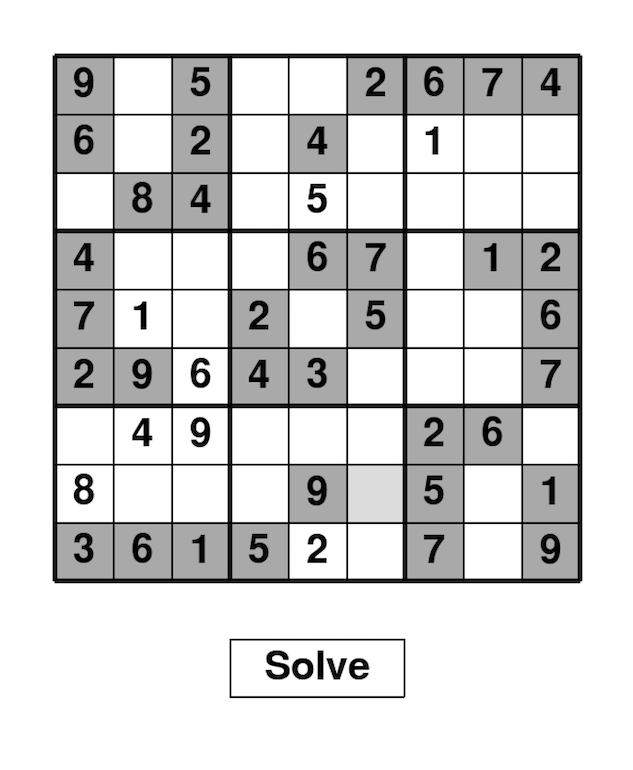
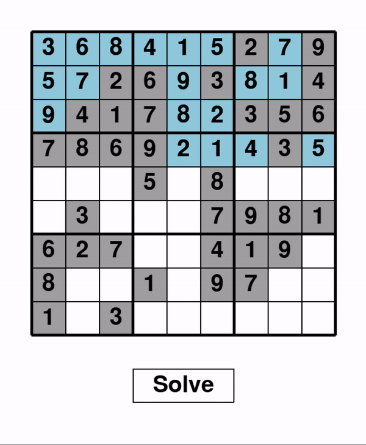

# 9x9 Sudoku GUI and solver


# Instructions on how to play (Python 3). 
In the terminal, 
1. Run ``` pip3 install -r requirements.txt ```
2. Run ``` python3 gui.py ```
3. Select a cell, input a number and press `return`. If correct, your number will stay in that cell. If not, the cell will turn red.
4. Enjoy 😊

# Sudoku solver visualization


Currently, there are only a few puzzles. Sudoku puzzle generator will be added soon.